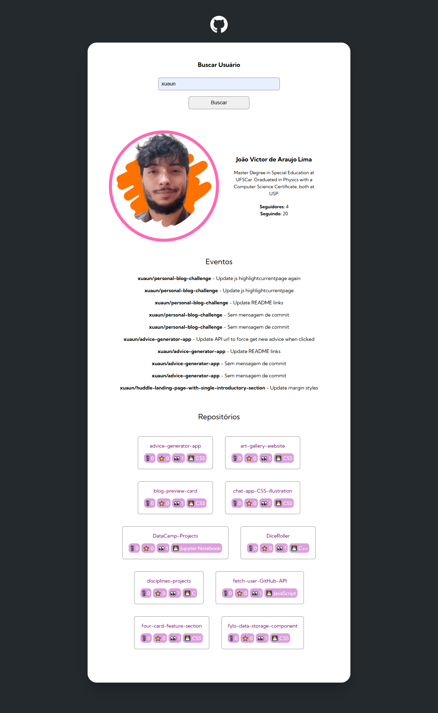
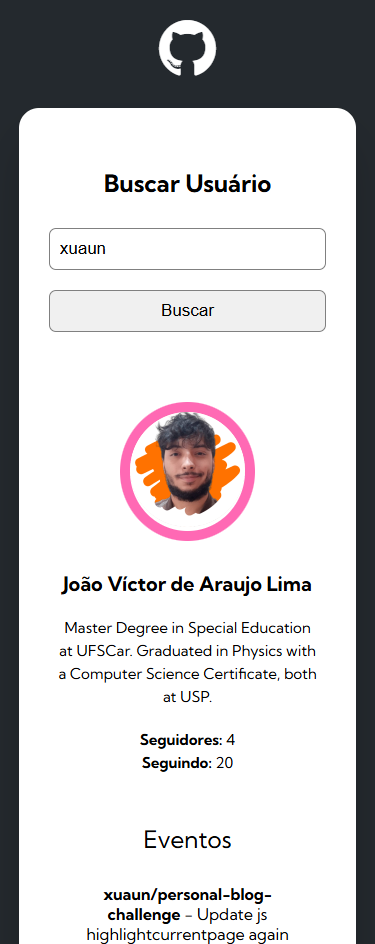

# DevQuest - Fetch with GitHub API

## Languages
This first section is in English. 

[Versão em português logo abaixo.](#portuguese)

## Context

This is a solution to the advanced JavaScript challenge from the [DevQuest course](https://evento.devemdobro.com/matriculas-abertas).

For this challenge, an initial code `index.html`, `reset.css` and `styles.css` was made available. In the classes, we made some initial codes in JavaScript with requests to the GitHub API - With the username, request full name, bio, profile picture and the last 10 repositories (with link).

From this, we needed to:

> 1. Add:
> - Number of followers of the user
> - Number of people the user is following
> 2. Add:
> - Information of the last 10 events (CreatEvent & PushEvent) of the user on GitHub
> 3. [TO-DO] Add:
> - Number of forks of the repository
> - Number of stars of the repository
> - Number of watchers of the repository
> - Show the programming language of the repository

## Table of contents

- [Overview](#overview)
  - [Screenshot](#screenshot)
  - [Links](#links)
- [My process](#my-process)
  - [Built with](#built-with)
  - [What I learned](#what-i-learned)
- [Author](#author)

## Overview

### Screenshot

#### Desktop

<p align="center">
  
</p>

#### Mobile

<p align="center">
  
</p>

### Links

- Solution URL: [GitHub Repository](https://github.com/xuaun/fetch-user-GitHub-API)
- Live Site URL: [Live Page](https://xuaun.github.io/fetch-user-GitHub-API/)

## My process

### Built with

- Semantic HTML5 markup
- CSS custom properties
- Flexbox
- Media Query
- JavaScript
- API (GitHub)

### What I learned


```js

```

## Author

- Website - [João Víctor de Araujo Lima's Portfolio](https://xuaun.github.io/)
- Frontend Mentor - [@xuaun](https://www.frontendmentor.io/profile/xuaun)


____
<br>


# <p id="portuguese"> DevQuest - Fetch com GitHub API</p>

## Contexto

Esta é uma solução para o desafio de JavaScript avançado do [curso DevQuest](https://evento.devemdobro.com/matriculas-abertas).

Para este desafio, foi disponibilizado um código inicial `index.html`, `reset.css` e `styles.css`. Nas aulas, realizamos alguns códigos iniciais em JavaScript com solicitações da API do GitHub - A partir do nome de usuário, pegar nome completo, bio, foto de perfil e os últimos 10 repositórios (com link).

A partir disso, foram feitas algumas solicitações:

> 1. Adicionar:
> - Número de seguidores do usuário
> - Número de pessoas que o usuário está seguindo
> 2. Adicionar:
> - Informações dos últimos 10 eventos (CreatEvent & PushEvent) do usuário no GitHub
> 3. [TO-DO] Adicionar:
> - Quantidade de forks do repositório
> - Quantidade de estrelas do repositório
> - Quantidade de watchers do repositório
> - Mostrar a linguagem de programação do repositório

## Lista de conteúdos

- [Visão Geral](#visão-geral)
  - [Prints](#prints)
  - [Links](#links-pt)
- [Meu processo](#meu-processo)
  - [Tecnologias utilizadas](#tecnologias-utilizadas)
  - [O que eu aprendi](#o-que-eu-aprendi)
- [Autor](#autor)

## Visão Geral

### Prints

#### Computador

<p align="center">
  
</p>

#### Celular

<p align="center">
  
</p>

### <p id="links-pt">Links</p>

- Link da solução: [Repositório no GitHub](https://github.com/xuaun/fetch-user-GitHub-API)
- Site com a solução: [Página do projeto no ar](https://xuaun.github.io/fetch-user-GitHub-API/)

## Meu processo

### Tecnologias utilizadas

- HTML5
- CSS
- Flexbox
- Media Query
- JavaScript
- API (GitHub)

### O que eu aprendi


```js

```

## Autor

- Website - [Portfólio - João Víctor de Araujo Lima](https://xuaun.github.io/)
- Frontend Mentor - [@xuaun](https://www.frontendmentor.io/profile/xuaun)
